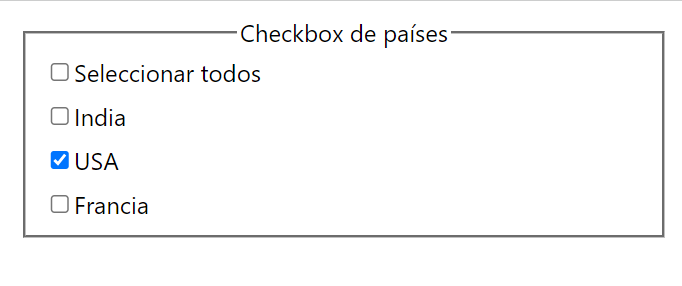

# Checkbox Challenge

Selector de checkbox desarrollado con React v18, TypeScript y Jest.

#### Cómo Probar

- Clona el repositorio.
- En la terminal del proyecto, ejecuta el siguiente comando para instalar las dependencias: ```npm install```
- Una vez finalizada la instalación, inicia el proyecto con el siguiente comando: ```npm run start```
- Si deseas ejecutar las pruebas, utiliza: ```npm run test```
<br>

#### Características:

- Se pueden seleccionar individualmente los países.
- Se puede seleccionar y deseleccionar todos los países al hacer clic en el checkbox "Seleccionar todos".
- Si todos los checkboxs están marcados y se hace clic en uno de los países, tanto el país como "Seleccionar todos" se desmarcan automáticamente.
- Si se seleccionan todos los países, "Seleccionar todos" se marca automáticamente.

<br>

<br>